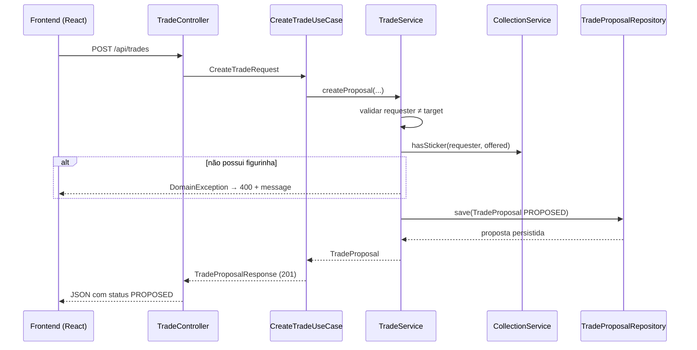

# Implementation Plan: MVP de Troca de Figurinhas da Copa

**Branch de implementação**: `feature/mvp-base` | **Feature Spec Kit**: `001-sticker-trade-mvp` | **Date**: 2026-06-26 | **Spec**: [spec.md](./spec.md)

**Input**: Feature specification from `/specs/001-sticker-trade-mvp/spec.md` e prompt de plan do treinamento (full stack, Docker, Swagger).

## Summary

Implementar uma aplicação **full stack** executável com `docker-compose up`: backend em **Java 21 + Spring Boot 3** com arquitetura em três camadas (domínio, aplicação, infraestrutura), frontend **React + Vite** consumindo a API REST, documentação interativa via **springdoc-openapi (Swagger UI)** e persistência **H2** em memória.

O domínio centraliza regras em `UserService`, `CollectionService` e `TradeService`, cobertas por testes unitários. O MVP entrega cadastro de colecionadores, registro de coleção com quantidade, consulta de repetidas e criação/listagem de propostas de troca com status inicial `PROPOSED` — sem aceite, recusa ou efetivação.

## Technical Context

**Language/Version**: Java 21 (backend), TypeScript (frontend)

**Primary Dependencies**: Spring Boot 3.4 (Web, Data JPA, Validation), springdoc-openapi, H2; React 18, Vite 6

**Storage**: H2 em memória (MVP); portas de repositório permitem troca futura por PostgreSQL

**Testing**: JUnit 5, Mockito, Spring Boot Test, MockMvc (backend); validação visual manual no browser (frontend)

**Target Platform**: Containers Docker — Linux/Windows/macOS com Docker Desktop

**Project Type**: web application (API REST + SPA)

**Performance Goals**: Resposta imediata para coleções de até 700 figurinhas (SC-003)

**Constraints**: Sem autenticação; álbum fixo 1..700; sem aceite/recusa/efetivação de troca; demonstração via browser obrigatória

**Scale/Scope**: Ambiente didático; 7 endpoints REST; 3 serviços de domínio; 4 telas/seções no frontend

## Constitution Check

*GATE: Must pass before Phase 0 research. Re-check after Phase 1 design.*

Referência: `.specify/memory/constitution.md`

- [x] **Simplicidade didática**: Spring Boot + React/Vite padrão, H2 em memória, sem microserviços
- [x] **Domínio explícito**: User, Album (config), UserCollection, TradeProposal, TradeStatus em [data-model.md](./data-model.md)
- [x] **Escopo da fase**: apenas cadastro, coleção, repetidas e proposta; sem Evolução 1/2
- [x] **Regras centralizadas**: validações em serviços de domínio; controllers e UI só delegam
- [x] **Camadas**: pacotes `domain`, `application`, `infrastructure` com dependência unidirecional
- [x] **Compatibilidade**: `TradeStatus` reserva ACCEPTED/REJECTED; portas de repositório estáveis
- [x] **Testes de domínio**: 6+ testes unitários de regras + testes de API (MockMvc)
- [x] **Demonstrabilidade visual**: frontend web + quickstart com fluxo via browser; Swagger como complemento

**Re-check pós-design**: todos os gates aprovados. Nenhuma violação em Complexity Tracking.

## Project Structure

### Documentation (this feature)

```text
specs/001-sticker-trade-mvp/
├── plan.md              # Este arquivo
├── research.md          # Decisões de stack e padrões
├── data-model.md        # Entidades, validações e persistência
├── quickstart.md        # Guia de execução e validação (Docker + browser)
├── contracts/
│   └── openapi.yaml     # Contrato REST
└── tasks.md             # Gerado por /speckit-tasks
```

### Source Code (repository root)

```text
# Backend (Maven — raiz do repositório)
src/main/java/com/albumx/
├── domain/
│   ├── model/              # User, UserCollection, TradeProposal, TradeStatus, Album
│   ├── service/            # UserService, CollectionService, TradeService
│   ├── repository/         # Portas: UserRepository, CollectionRepository, TradeProposalRepository
│   └── exception/          # DomainException e subclasses
├── application/
│   ├── usecase/            # CreateUser, AddSticker, GetCollection, GetDuplicates, CreateTrade, ListTrades
│   └── dto/                # Request/Response records
└── infrastructure/
    ├── persistence/        # Entidades JPA, adapters dos repositórios
    ├── web/                # REST controllers, GlobalExceptionHandler, CorsConfig
    └── config/             # AlbumProperties, OpenApiConfig

src/main/resources/
├── application.yml
└── application-docker.yml

src/test/java/com/albumx/
├── domain/service/         # Testes unitários dos serviços de domínio
└── infrastructure/web/     # Testes de integração MockMvc

# Frontend
frontend/
├── src/
│   ├── api/                # Cliente HTTP (fetch) alinhado ao OpenAPI
│   ├── components/         # Formulários e listagens reutilizáveis
│   ├── pages/              # Usuários, Coleção, Repetidas, Trocas
│   ├── App.tsx
│   └── main.tsx
├── Dockerfile
├── nginx.conf              # Proxy reverso / SPA fallback
├── package.json
└── vite.config.ts

# Infraestrutura de execução
Dockerfile                    # Backend multi-stage
docker-compose.yml            # backend + frontend
pom.xml
```

**Structure Decision**: monorepo com backend Maven na raiz (já iniciado) e pasta `frontend/` para a SPA. Docker Compose orquestra os dois serviços. Domínio não importa Spring nem React.

## Arquitetura

### Visão geral full stack

```text
┌──────────────────────────────────────────────────────────────────┐
│  Browser                                                         │
│  ┌─────────────────────┐    ┌─────────────────────────────────┐ │
│  │ Frontend (React)    │    │ Swagger UI (/swagger-ui.html)   │ │
│  │ http://localhost:   │    │ http://localhost:8080           │ │
│  │        3000         │    └─────────────────────────────────┘ │
└────────┬────────────────────┬────────────────────────────────────┘
         │ REST JSON          │ REST JSON
         ▼                    ▼
┌──────────────────────────────────────────────────────────────────┐
│  Backend (Spring Boot) — porta 8080                            │
│  infrastructure/web → application/usecase → domain/service       │
│  infrastructure/persistence → H2 (memória)                       │
└──────────────────────────────────────────────────────────────────┘
```

### Camadas do backend

```text
┌─────────────────────────────────────────────────────────┐
│  infrastructure/web (Controllers + CORS)                │
│  - Mapeia HTTP ↔ DTO; sem regras de negócio             │
└───────────────────────────┬─────────────────────────────┘
                            │
┌───────────────────────────▼─────────────────────────────┐
│  application/usecase                                      │
│  - Orquestra um caso de uso por operação                  │
│  - Converte DTO ↔ domínio                                 │
└───────────────────────────┬─────────────────────────────┘
                            │
┌───────────────────────────▼─────────────────────────────┐
│  domain/service + domain/model                            │
│  - Regras de negócio centralizadas                        │
│  - Depende apenas de portas (repository interfaces)     │
└───────────────────────────┬─────────────────────────────┘
                            │
┌───────────────────────────▼─────────────────────────────┐
│  infrastructure/persistence                               │
│  - JPA entities + adapters                                │
└─────────────────────────────────────────────────────────┘
```

### Componentes principais

| Componente | Camada | Responsabilidade |
|------------|--------|------------------|
| `UserService` | domínio | Cadastrar e buscar usuário; validar nome |
| `CollectionService` | domínio | Adicionar figurinha, consultar coleção, listar repetidas |
| `TradeService` | domínio | Criar proposta; validar posse da figurinha oferecida; listar propostas |
| `Album` / `AlbumProperties` | domínio + config | Validar número da figurinha em [1, N] |
| `*UseCase` | aplicação | Um caso de uso por operação; delega ao serviço |
| `UserController` | infra | `POST/GET /api/users` |
| `CollectionController` | infra | Coleção e repetidas |
| `TradeController` | infra | `POST/GET /api/trades` |
| `CorsConfig` | infra | Permitir origem do frontend (`localhost:3000`) |
| `OpenApiConfig` | infra | Swagger UI e alinhamento com `openapi.yaml` |
| `apiClient.ts` | frontend | Chamadas HTTP tipadas à API |
| Páginas React | frontend | Formulários e listagens dos fluxos MVP |
| `docker-compose.yml` | infra | Orquestra backend + frontend |

### Fluxo: criar proposta de troca



## Casos de uso

| Caso de uso | Endpoint | UI (frontend) | Serviço principal | Pré-condições |
|-------------|----------|---------------|-------------------|---------------|
| UC-01 Criar usuário | `POST /api/users` | Formulário "Cadastrar colecionador" | UserService | Nome válido |
| UC-02 Buscar usuário | `GET /api/users/{id}` | Seleção de usuário ativo | UserService | ID existente |
| UC-03 Adicionar figurinha | `POST /api/users/{id}/collection/stickers` | Formulário "Adicionar figurinha" | CollectionService | Usuário existe; número válido |
| UC-04 Listar coleção | `GET /api/users/{id}/collection` | Tabela/lista da coleção | CollectionService | Usuário existe |
| UC-05 Listar repetidas | `GET /api/users/{id}/collection/duplicates` | Seção "Repetidas" | CollectionService | Usuário existe |
| UC-06 Criar proposta | `POST /api/trades` | Formulário "Nova proposta" | TradeService | Ambos usuários existem; solicitante possui oferta |
| UC-07 Listar propostas | `GET /api/trades` | Lista de propostas | TradeService | Filtros opcionais por requester/target |

## Validações e erros

Detalhamento completo em [data-model.md](./data-model.md#validações-consolidadas).

| Regra | Comportamento | HTTP |
|-------|---------------|------|
| Nome vazio | `InvalidUserNameException` | 400 |
| Usuário inexistente | `UserNotFoundException` | 404 |
| Figurinha fora do álbum | `InvalidStickerNumberException` | 400 |
| Solicitante sem figurinha oferecida | `StickerNotOwnedException` | 400 |
| Troca para si mesmo | `SelfTradeException` | 400 |

Mensagens em português no campo `message` (SC-002, FR-020). O frontend exibe o erro sem quebrar a página.

## Containerização

### Serviços Docker Compose

| Serviço | Imagem / build | Porta | Descrição |
|---------|----------------|-------|-----------|
| `backend` | `Dockerfile` (raiz) | 8080 | API REST + Swagger + H2 |
| `frontend` | `frontend/Dockerfile` | 3000 | SPA React servida por Nginx |

### Variáveis de ambiente

| Variável | Serviço | Valor (compose) |
|----------|---------|-----------------|
| `SPRING_PROFILES_ACTIVE` | backend | `docker` |
| `VITE_API_URL` | frontend (build) | `http://localhost:8080` |

### Comando de execução

```bash
docker-compose up --build
```

- Frontend: `http://localhost:3000`
- API: `http://localhost:8080`
- Swagger: `http://localhost:8080/swagger-ui.html`

## Estratégia de testes

### Testes unitários de domínio (`src/test/java/.../domain/service/`)

| Teste | Cenário |
|-------|---------|
| `UserServiceTest` | Cadastro com sucesso; rejeição de nome vazio |
| `CollectionServiceTest` | Adicionar figurinha; múltiplas unidades; repetidas corretas |
| `CollectionServiceTest` | Lista vazia de repetidas; rejeição de número inválido |
| `TradeServiceTest` | Proposta válida com status PROPOSED |
| `TradeServiceTest` | Rejeição quando solicitante não possui figurinha |
| `TradeServiceTest` | Rejeição quando solicitante = destinatário |

Repositórios mockados com Mockito; **sem** contexto Spring nos testes de domínio.

### Testes de integração (`MockMvc`)

- Fluxo feliz: criar 2 usuários → adicionar figurinhas → consultar repetidas → criar proposta → listar propostas.
- `POST /api/trades` com figurinha não possuída retorna 400.

### Validação visual (quickstart)

- Fluxo completo via browser em menos de 5 minutos (SC-005, SC-006).
- Swagger: invocar cada endpoint do MVP (SC-008).

### Cobertura mínima aceitável

- 100% dos métodos públicos dos três serviços de domínio com pelo menos um teste de sucesso e um de falha quando aplicável.
- Todos os 7 endpoints REST com pelo menos um teste de integração.

## Configuração

```yaml
# application.yml (trecho)
album:
  sticker-count: 700

spring:
  datasource:
    url: jdbc:h2:mem:albumx
  jpa:
    hibernate:
      ddl-auto: create-drop

springdoc:
  swagger-ui:
    path: /swagger-ui.html
```

## Git e fluxo de desenvolvimento

1. Criar e trabalhar na branch **`feature/mvp-base`**.
2. Commits atômicos com mensagens claras (ex.: `feat(domain): adicionar TradeService`, `feat(frontend): tela de propostas de troca`).
3. Artefatos Spec Kit em `specs/001-sticker-trade-mvp/` versionados na mesma branch.

## Preparação para evoluções

| Evolução | Extensão planejada |
|----------|-------------------|
| Evolução 1 | `TradeService.accept()` / `reject()`; transição de status; `CollectionService.transfer()` |
| Evolução 2 | Novo `TradeSuggestionService`; consultas analíticas sem alterar contratos MVP |

Manter `TradeStatus` como enum desde o MVP. Portas de repositório estáveis evitam quebrar testes existentes. Frontend ganha novas telas sem alterar contratos atuais.

## Complexity Tracking

> Nenhuma violação da constituição. Seção vazia intencionalmente.

| Violation | Why Needed | Simpler Alternative Rejected Because |
|-----------|------------|-------------------------------------|
| — | — | — |

## Artefatos gerados

| Artefato | Caminho |
|----------|---------|
| Pesquisa e decisões | [research.md](./research.md) |
| Modelo de dados | [data-model.md](./data-model.md) |
| Contrato API | [contracts/openapi.yaml](./contracts/openapi.yaml) |
| Guia de validação | [quickstart.md](./quickstart.md) |

**Próximo passo**: executar `/speckit-tasks` para gerar `tasks.md` e iniciar implementação na branch `feature/mvp-base` com `/speckit-implement`.
