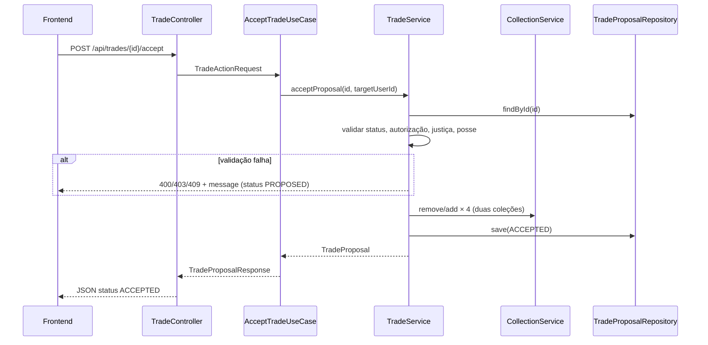
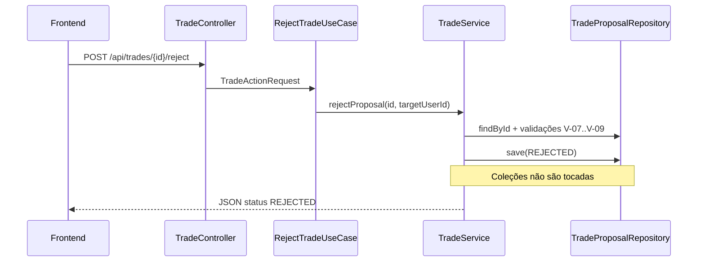

# Implementation Plan: Evolução 1 — Aceitar e Recusar Trocas

**Branch de implementação**: `002-trade-accept-reject` | **Feature Spec Kit**: `002-trade-accept-reject` | **Date**: 2026-06-26 | **Spec**: [spec.md](./spec.md)

**Input**: Feature specification from `/specs/002-trade-accept-reject/spec.md` e prompt de plan (aceite/recusa, validações, frontend, compatibilidade MVP).

**Depende de**: MVP entregue em `001-sticker-trade-mvp` — usuários, coleções, repetidas, propostas `PROPOSED`.

## Summary

Estender o AlbumX **sem breaking changes** no MVP: ativar transições de `TradeStatus` (`PROPOSED` → `ACCEPTED` | `REJECTED`), implementar aceite transacional com validação de posse e troca justa, recusa sem efeito colateral, novos métodos em `CollectionService`/`TradeService`, três novos endpoints REST, testes de domínio e integração, e evolução da `TradesPage` para listar propostas recebidas com ações de aceitar/recusar.

Stack inalterada: **Java 21 + Spring Boot 3**, **React + Vite**, **H2**, **Docker Compose**, **springdoc-openapi**.

## Technical Context

**Language/Version**: Java 21 (backend), TypeScript (frontend)

**Primary Dependencies**: Spring Boot 3.4 (Web, Data JPA, Validation, Transaction), springdoc-openapi, H2; React 18, Vite 6

**Storage**: H2 em memória; schema existente suporta novos valores de enum `status`

**Testing**: JUnit 5, Mockito, Spring Boot Test, MockMvc; validação visual via browser

**Target Platform**: Containers Docker — Linux/Windows/macOS

**Project Type**: web application (API REST + SPA)

**Performance Goals**: Resposta imediata; aceite envolve 4 updates de coleção + 1 update de proposta na mesma transação

**Constraints**: Sem autenticação; apenas destinatário aceita/recusa; regra de figurinha única **desativada por padrão**; zero regressão nos 7 endpoints MVP

**Scale/Scope**: +3 endpoints REST; +5 exceções de domínio; +4 métodos em serviços; extensão de 1 página frontend

## Constitution Check

*GATE: Must pass before Phase 0 research. Re-check after Phase 1 design.*

Referência: `.specify/memory/constitution.md`

- [x] **Simplicidade didática**: extensão incremental sobre código MVP; `@Transactional` no use case; config booleana simples
- [x] **Domínio explícito**: transições de `TradeProposal` documentadas em [data-model.md](./data-model.md)
- [x] **Spec-first / escopo da fase**: apenas aceite, recusa, validações e UI correspondente; sem Evolução 2
- [x] **Regras centralizadas**: aceite/recusa e validações em `TradeService`; mutação de coleção em `CollectionService`
- [x] **Camadas**: novos use cases + controllers delegam; domínio sem Spring
- [x] **Compatibilidade**: endpoints MVP inalterados; enum `TradeStatus` já reservado no MVP
- [x] **Testes de domínio**: plano cobre 9+ cenários novos em `TradeServiceTest` e `CollectionServiceTest`
- [x] **Demonstrabilidade visual**: quickstart com fluxo browser aceite/recusa; Swagger atualizado

**Re-check pós-design**: todos os gates aprovados. Nenhuma violação em Complexity Tracking.

## Project Structure

### Documentation (this feature)

```text
specs/002-trade-accept-reject/
├── plan.md              # Este arquivo
├── research.md          # Decisões de transação, endpoints, exceções
├── data-model.md        # Transições, validações V-07..V-13
├── quickstart.md        # Validação browser + Swagger
├── contracts/
│   └── openapi.yaml     # Contrato REST v1.1.0 (MVP + Evolução 1)
└── tasks.md             # Gerado por /speckit-tasks
```

### Source Code (alterações previstas)

```text
src/main/java/com/albumx/
├── domain/
│   ├── model/UserCollection.java       # + removeSticker
│   ├── service/CollectionService.java  # + removeSticker, getQuantity, hasDuplicate
│   ├── service/TradeService.java       # + acceptProposal, rejectProposal, getProposal
│   ├── repository/TradeProposalRepository.java  # + findById
│   └── exception/                      # + TradeNotFound, TradeAlreadyFinalized,
│                                       #   UnauthorizedTradeAction, UnfairTrade,
│                                       #   SingleStickerProtection
├── application/
│   ├── usecase/AcceptTradeUseCase.java
│   ├── usecase/RejectTradeUseCase.java
│   ├── usecase/GetTradeUseCase.java
│   └── dto/TradeActionRequest.java
└── infrastructure/
    ├── config/AlbumProperties.java     # + trade.protect-single-sticker
    ├── web/TradeController.java        # + GET /{id}, POST /{id}/accept|reject
    └── web/GlobalExceptionHandler.java # + mapeamento 403/409

src/test/java/com/albumx/
├── domain/service/TradeServiceTest.java       # + cenários aceite/recusa
├── domain/service/CollectionServiceTest.java  # + removeSticker, hasDuplicate
└── infrastructure/web/TradeControllerTest.java
                                               # + AlbumXFlowTest estendido

frontend/src/
├── api/apiClient.ts                    # + acceptTrade, rejectTrade, getTrade
├── pages/TradesPage.tsx                # seções enviadas/recebidas + ações
└── components/TradeActions.tsx         # (opcional) botões aceitar/recusar
```

**Structure Decision**: monorepo existente; diff mínimo e localizado. Nenhum novo serviço Docker.

## Plano de implementação incremental

Implementação ordenada para **não quebrar o MVP** a cada etapa. Cada fase deve manter `mvn test` verde.

### Fase A — Fundação do domínio (sem expor API)

**Objetivo**: preparar mutação de coleção e exceções antes de ativar aceite.

| # | Tarefa | Arquivos | Critério de done |
|---|--------|----------|------------------|
| A1 | `UserCollection.removeSticker(n)` — decrementa; remove se qty=0; falha se qty=0 | `UserCollection.java` | Teste unitário em `CollectionServiceTest` |
| A2 | `CollectionService.removeSticker`, `getQuantity`, `hasDuplicate` | `CollectionService.java` | Testes: remove ok; remove sem posse → exceção; hasDuplicate |
| A3 | Novas exceções de domínio com código e mensagem PT | `domain/exception/*` | Classes compilam; estendem `DomainException` |
| A4 | `TradeProposalRepository.findById` + adapter JPA | `repository`, `persistence` | Mock testável |
| A5 | Config `album.trade.protect-single-sticker: false` | `AlbumProperties`, `application.yml` | Default false documentado |

**Checkpoint**: MVP continua 100% funcional; nenhum endpoint novo.

### Fase B — Lógica de aceite e recusa (domínio)

**Objetivo**: regras de negócio completas testáveis sem HTTP.

| # | Tarefa | Detalhe |
|---|--------|---------|
| B1 | `TradeService.rejectProposal(id, targetUserId)` | Valida V-07..V-09; status → REJECTED; save |
| B2 | `TradeService.acceptProposal(id, targetUserId)` | Pipeline abaixo |
| B3 | `TradeService.getProposal(id)` | Consulta por ID |

**Pipeline de `acceptProposal`** (transação lógica):

```text
1. proposal = findById(id)           → 404 se ausente
2. assert status == PROPOSED         → 409 se ACCEPTED/REJECTED
3. assert targetUserId == proposal.targetUserId → 403
4. assert offered != requested       → 400 UNFAIR_TRADE
5. assert requester has offered (qty≥1) → 400 STICKER_NOT_OWNED
6. assert target has requested (qty≥1)  → 400 STICKER_NOT_OWNED
7. if protectSingleSticker:
     assert requester qty(offered) > 1 OR skip if qty>1
     assert target qty(requested) > 1
8. collectionService.removeSticker(requester, offered)
   collectionService.addSticker(requester, requested)
   collectionService.removeSticker(target, requested)
   collectionService.addSticker(target, offered)
9. proposal.status = ACCEPTED; save
10. return proposal
```

**Importante**: passos 8–9 só após passos 1–7 OK. Falha em 4–7 **não** altera status nem coleções.

| # | Teste (`TradeServiceTest`) | Esperado |
|---|---------------------------|----------|
| T1 | Aceite válido | ACCEPTED; 4 chamadas CollectionService |
| T2 | Coleção solicitante atualizada | remove offered + add requested |
| T3 | Coleção destinatário atualizada | remove requested + add offered |
| T4 | Recusa válida | REJECTED; zero chamadas remove/add |
| T5 | Aceitar já ACCEPTED | TradeAlreadyFinalizedException |
| T6 | Recusar já ACCEPTED | TradeAlreadyFinalizedException |
| T7 | Aceitar sem figurinha disponível | StickerNotOwnedException; status PROPOSED |
| T8 | Troca injusta (mesmo número) | UnfairTradeException |
| T9 | Figurinha única (config true) | SingleStickerProtectionException |

**Checkpoint**: `TradeServiceTest` e `CollectionServiceTest` verdes; controllers ainda inalterados.

### Fase C — Camada de aplicação e infraestrutura REST

**Objetivo**: expor operações via API com transação Spring.

| # | Tarefa | Arquivos |
|---|--------|----------|
| C1 | DTO `TradeActionRequest` (targetUserId) | `application/dto` |
| C2 | `AcceptTradeUseCase` com `@Transactional` | `application/usecase` |
| C3 | `RejectTradeUseCase` com `@Transactional` | `application/usecase` |
| C4 | `GetTradeUseCase` | `application/usecase` |
| C5 | Endpoints no `TradeController` | ver contrato OpenAPI |
| C6 | `GlobalExceptionHandler`: 403, 409 | `infrastructure/web` |
| C7 | Registrar beans no `DomainConfig` se necessário | `infrastructure/config` |

**Novos endpoints** (não alteram existentes):

| Método | Path | Body | Response |
|--------|------|------|----------|
| GET | `/api/trades/{tradeId}` | — | `TradeProposalResponse` |
| POST | `/api/trades/{tradeId}/accept` | `{ targetUserId }` | 200 + ACCEPTED |
| POST | `/api/trades/{tradeId}/reject` | `{ targetUserId }` | 200 + REJECTED |

**Checkpoint**: testes MockMvc para novos endpoints + regressão dos endpoints MVP.

### Fase D — Frontend

**Objetivo**: fluxo visual de avaliação de trocas (FR-020–FR-024).

| # | Tarefa | Detalhe |
|---|--------|---------|
| D1 | `apiClient`: `acceptTrade`, `rejectTrade`, `getTrade` | Alinhado ao OpenAPI |
| D2 | `TradesPage`: seção **Propostas recebidas** | `listTrades(undefined, activeUserId)` |
| D3 | Botões Aceitar / Recusar | Visíveis só se `status === 'PROPOSED'` e usuário ativo = destinatário |
| D4 | Badges de status | PROPOSED / ACCEPTED / REJECTED com classes CSS distintas |
| D5 | Seção **Propostas enviadas** (opcional) | `listTrades(activeUserId)` — somente leitura |
| D6 | Tratamento de erro | Reutilizar `ErrorMessage`; desabilitar botões durante request |
| D7 | Atualizar lista após ação | Reload trades + feedback de sucesso |

**Checkpoint**: quickstart cenários 1–3 passam no browser.

### Fase E — Documentação e regressão final

| # | Tarefa |
|---|--------|
| E1 | Swagger reflete novos endpoints (springdoc auto + openapi.yaml) |
| E2 | `AlbumXFlowTest`: MVP + aceite + verificar coleções |
| E3 | Executar quickstart completo |
| E4 | Confirmar SC-008: fluxo MVP sem regressão |

## Arquitetura

### Fluxo: aceitar proposta



### Fluxo: recusar proposta



## Casos de uso

| Caso de uso | Endpoint | UI | Serviço | Pré-condições |
|-------------|----------|-----|---------|---------------|
| UC-E1 Aceitar troca | `POST .../accept` | Botão Aceitar (recebidas) | TradeService | PROPOSED; actor = destinatário; posse válida |
| UC-E2 Recusar troca | `POST .../reject` | Botão Recusar (recebidas) | TradeService | PROPOSED; actor = destinatário |
| UC-E3 Consultar status | `GET .../{tradeId}` | Detalhe/lista | TradeService | ID existe |
| UC-E4 Validar antes aceite | (implícito no aceite) | Erro na UI | TradeService | Regras V-10..V-13 |
| UC-MVP-* | (inalterados) | (inalterados) | — | Comportamento MVP preservado |

## Validações e erros

Detalhamento em [data-model.md](./data-model.md#validações-consolidadas-mvp--evolução-1).

| Regra | Exceção | HTTP |
|-------|---------|------|
| Proposta inexistente | `TradeNotFoundException` | 404 |
| Já finalizada | `TradeAlreadyFinalizedException` | 409 |
| Não é destinatário | `UnauthorizedTradeActionException` | 403 |
| Sem posse no aceite | `StickerNotOwnedException` | 400 |
| Troca injusta | `UnfairTradeException` | 400 |
| Figurinha única (config) | `SingleStickerProtectionException` | 400 |

## Estratégia de testes

### Testes unitários de domínio

| Classe | Novos cenários |
|--------|----------------|
| `CollectionServiceTest` | removeSticker; getQuantity; hasDuplicate; remove sem posse |
| `TradeServiceTest` | T1–T9 da Fase B |

### Testes de integração (MockMvc)

| Teste | Cenário |
|-------|---------|
| `TradeControllerTest` | Aceite feliz → 200 ACCEPTED |
| `TradeControllerTest` | Recusa feliz → 200 REJECTED |
| `TradeControllerTest` | Aceite por solicitante → 403 |
| `TradeControllerTest` | Aceite proposta finalizada → 409 |
| `TradeControllerTest` | GET trade por ID |
| `AlbumXFlowTest` | Fluxo E2E MVP + aceite + assert coleções |

### Regressão MVP

Todos os testes existentes em `UserControllerTest`, `CollectionControllerTest`, `TradeControllerTest` (create/list) e serviços MVP devem permanecer verdes sem alteração de comportamento.

## Configuração

```yaml
# application.yml (trecho adicionado)
album:
  sticker-count: 700
  trade:
    protect-single-sticker: false   # true para ativar FR-014/FR-015
```

## Git e fluxo de desenvolvimento

1. Trabalhar na branch **`002-trade-accept-reject`** (ou criar a partir de `main`/`feature/mvp-base` conforme estado do repo).
2. Commits atômicos por fase (ex.: `feat(domain): aceitar e recusar proposta`, `feat(web): endpoints accept/reject`, `feat(frontend): ações em propostas recebidas`).
3. Artefatos Spec Kit versionados em `specs/002-trade-accept-reject/`.

## Compatibilidade com MVP

| Aspecto | Garantia |
|---------|----------|
| `POST /api/trades` | Continua criando PROPOSED sem alterar coleções |
| `GET /api/trades` | Mesmos filtros; passa a retornar ACCEPTED/REJECTED quando aplicável |
| Enum `TradeStatus` | Valores já existiam; agora ativados |
| Frontend MVP | Formulário de nova proposta inalterado; seções adicionadas |
| Testes MVP | Devem passar sem modificação de asserções |

## Preparação para Evolução 2

| Evolução | Extensão planejada |
|----------|-------------------|
| Evolução 2 | `TradeSuggestionService`; ranking; sem alterar contratos de aceite/recusa |

Portas de repositório e contratos REST estáveis permitem adicionar sugestões sem refatorar aceite.

## Complexity Tracking

> Nenhuma violação da constituição. Seção vazia intencionalmente.

| Violation | Why Needed | Simpler Alternative Rejected Because |
|-----------|------------|-------------------------------------|
| — | — | — |

## Artefatos gerados

| Artefato | Caminho |
|----------|---------|
| Pesquisa e decisões | [research.md](./research.md) |
| Modelo de dados | [data-model.md](./data-model.md) |
| Contrato API | [contracts/openapi.yaml](./contracts/openapi.yaml) |
| Guia de validação | [quickstart.md](./quickstart.md) |

**Próximo passo**: executar `/speckit-tasks` para gerar `tasks.md` e iniciar implementação com `/speckit-implement`.
