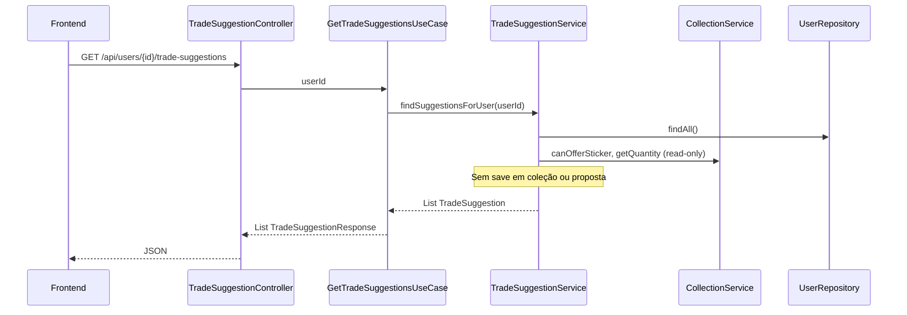
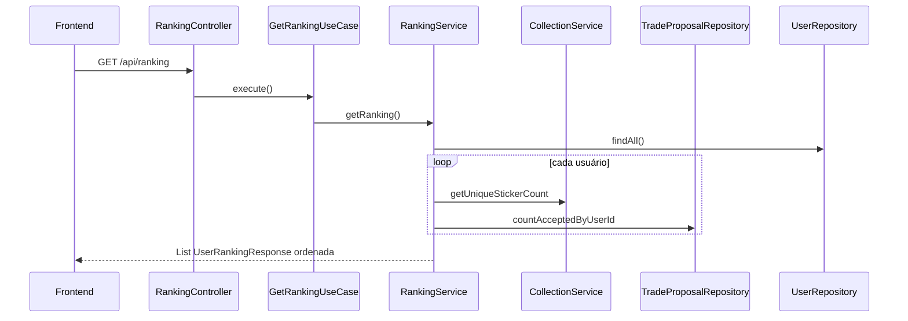
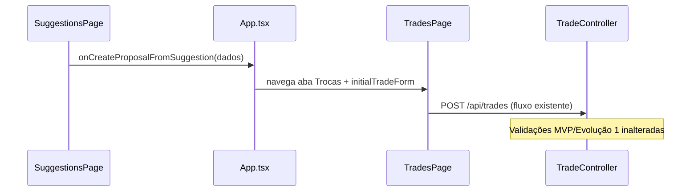

# Implementation Plan: Evolução 2 — Sugestão de Trocas e Ranking

**Branch de implementação**: `003-trade-suggestions-ranking` | **Feature Spec Kit**: `003-trade-suggestions-ranking` | **Date**: 2026-07-02 | **Spec**: [spec.md](./spec.md)

**Input**: Feature specification from `/specs/003-trade-suggestions-ranking/spec.md` e prompt de plan (sugestões automáticas, ranking, frontend, compatibilidade MVP/Evolução 1).

**Depende de**: MVP (`001-sticker-trade-mvp`) e Evolução 1 (`002-trade-accept-reject`) — usuários, coleções, repetidas, propostas, aceite/recusa e validações de negócio.

## Summary

Estender o AlbumX com **inteligência consultiva** sobre dados existentes: `TradeSuggestionService` analisa coleções em pares e retorna oportunidades de troca mútua (1:1, sem persistência nem criação automática de propostas); `RankingService` calcula posições por percentual de conclusão do álbum e trocas aceitas. Novos value objects (`TradeSuggestion`, `UserRankingPosition`), extensões read-only em `CollectionService`/`TradeProposalRepository`/`UserRepository`, +2 endpoints REST principais (+1 opcional global), testes de domínio, e duas novas abas no frontend (sugestões com ponte para criar proposta, ranking).

Stack inalterada: **Java 21 + Spring Boot 3**, **React + Vite**, **H2**, **Docker Compose**, **springdoc-openapi**.

## Technical Context

**Language/Version**: Java 21 (backend), TypeScript (frontend)

**Primary Dependencies**: Spring Boot 3.4 (Web, Data JPA, Validation, Transaction), springdoc-openapi, H2; React 18, Vite 6

**Storage**: H2 em memória; **nenhuma nova tabela** — sugestões e ranking são calculados sob demanda

**Testing**: JUnit 5, Mockito, Spring Boot Test, MockMvc; validação visual via browser

**Target Platform**: Containers Docker — Linux/Windows/macOS

**Project Type**: web application (API REST + SPA)

**Performance Goals**: Resposta imediata para dezenas de usuários (escala didática); algoritmo O(n² × r²) aceitável em treinamento

**Constraints**: Sem autenticação; consultas read-only não alteram coleções nem propostas; regra de figurinha única **desativada por padrão** (reutiliza config Evolução 1); zero regressão nos endpoints MVP e Evolução 1

**Scale/Scope**: +2 endpoints REST obrigatórios (+1 opcional); +2 serviços de domínio; +4 métodos em `CollectionService`; +1 método em repositórios; +2 páginas frontend; extensão de `App.tsx` e `apiClient.ts`

## Constitution Check

*GATE: Must pass before Phase 0 research. Re-check after Phase 1 design.*

Referência: `.specify/memory/constitution.md`

- [x] **Simplicidade didática**: algoritmos explícitos em pares; sem ML, cache ou persistência de sugestões
- [x] **Domínio explícito**: `TradeSuggestion` e `UserRankingPosition` como conceitos derivados documentados; vocabulário alinhado à spec
- [x] **Spec-first / escopo da fase**: apenas Evolução 2; sem chat, notificações ou gamificação avançada
- [x] **Regras centralizadas**: lógica de oferta em `CollectionService.canOfferSticker`; sugestões em `TradeSuggestionService`; ranking em `RankingService`
- [x] **Camadas**: use cases + controllers delegam; domínio sem Spring
- [x] **Compatibilidade**: endpoints existentes inalterados; OpenAPI v1.2.0 aditiva
- [x] **Testes de domínio**: plano cobre 12+ cenários em `TradeSuggestionServiceTest` e `RankingServiceTest`
- [x] **Demonstrabilidade visual**: quickstart com abas Sugestões e Ranking no browser

**Re-check pós-design**: todos os gates aprovados. Nenhuma violação em Complexity Tracking.

## Project Structure

### Documentation (this feature)

```text
specs/003-trade-suggestions-ranking/
├── plan.md              # Este arquivo
├── research.md          # Decisões de algoritmo, endpoints, frontend
├── data-model.md        # Value objects, extensões de serviço, validações V-20..V-25
├── quickstart.md        # Validação browser + Swagger
├── contracts/
│   └── openapi.yaml     # Contrato REST v1.2.0 (MVP + Evolução 1 + Evolução 2)
└── tasks.md             # Gerado por /speckit-tasks
```

### Source Code (alterações previstas)

```text
src/main/java/com/albumx/
├── domain/
│   ├── model/
│   │   ├── TradeSuggestion.java          # value object
│   │   └── UserRankingPosition.java      # value object
│   ├── service/
│   │   ├── CollectionService.java        # + getUniqueStickerCount, getMissingStickerNumbers, canOfferSticker
│   │   ├── TradeSuggestionService.java   # novo
│   │   └── RankingService.java           # novo
│   ├── repository/
│   │   ├── UserRepository.java           # + findAll
│   │   └── TradeProposalRepository.java  # + countAcceptedByUserId
│   └── model/UserCollection.java         # + getUniqueStickerNumbers, getMissingStickerNumbers
├── application/
│   ├── usecase/
│   │   ├── GetTradeSuggestionsUseCase.java
│   │   ├── GetAllTradeSuggestionsUseCase.java  # opcional
│   │   └── GetRankingUseCase.java
│   └── dto/
│       ├── TradeSuggestionResponse.java
│       └── UserRankingResponse.java
└── infrastructure/
    ├── config/DomainConfig.java          # beans TradeSuggestionService, RankingService
    ├── persistence/
    │   ├── UserRepositoryAdapter.java    # + findAll
    │   └── TradeProposalRepositoryAdapter.java  # + countAcceptedByUserId
    └── web/
        ├── TradeSuggestionController.java
        └── RankingController.java

src/test/java/com/albumx/
├── domain/service/
│   ├── TradeSuggestionServiceTest.java
│   ├── RankingServiceTest.java
│   └── CollectionServiceTest.java        # + novos métodos read-only
└── infrastructure/web/
    ├── TradeSuggestionControllerTest.java
    ├── RankingControllerTest.java
    └── AlbumXFlowTest.java               # estendido: sugestões + ranking

frontend/src/
├── api/apiClient.ts                      # + getTradeSuggestions, getRanking
├── pages/
│   ├── SuggestionsPage.tsx               # novo
│   └── RankingPage.tsx                   # novo
├── components/
│   └── SuggestionList.tsx                # (opcional) lista + botão criar proposta
└── App.tsx                               # abas Sugestões e Ranking; estado pré-preenchimento
```

**Structure Decision**: monorepo existente; diff mínimo e localizado. Nenhum novo serviço Docker.

## Plano de implementação incremental

Implementação ordenada para **não quebrar MVP/Evolução 1** a cada etapa. Cada fase deve manter `mvn test` verde.

### Fase A — Fundação read-only no domínio (sem expor API)

**Objetivo**: preparar consultas de coleção, usuários e trocas aceitas antes dos serviços de inteligência.

| # | Tarefa | Arquivos | Critério de done |
|---|--------|----------|------------------|
| A1 | `UserCollection.getUniqueStickerNumbers()` e `getMissingStickerNumbers(albumSize)` | `UserCollection.java` | Testes unitários via `CollectionServiceTest` |
| A2 | `CollectionService`: `getUniqueStickerCount`, `getMissingStickerNumbers`, `canOfferSticker` | `CollectionService.java` | Testes: contagem, ausências, oferta com/sem protectSingleSticker |
| A3 | `UserRepository.findAll()` + adapter JPA | `UserRepository`, `UserRepositoryAdapter` | Retorna todos os usuários |
| A4 | `TradeProposalRepository.countAcceptedByUserId(userId)` + query JPA | `TradeProposalRepository`, adapter | Conta ACCEPTED como requester ou target |
| A5 | Value objects `TradeSuggestion` e `UserRankingPosition` | `domain/model` | Imutáveis; campos conforme data-model |

**Checkpoint**: MVP e Evolução 1 100% funcionais; nenhum endpoint novo.

### Fase B — Serviços de sugestão e ranking (domínio)

**Objetivo**: regras de negócio completas testáveis sem HTTP.

| # | Tarefa | Detalhe |
|---|--------|---------|
| B1 | `TradeSuggestionService` com `findSuggestionsForUser(userId)` | Algoritmo em pares; perspectiva do usuário consultado |
| B2 | `TradeSuggestionService.findAllSuggestions()` (opcional) | Todas as oportunidades; útil para Swagger/didática |
| B3 | `RankingService.getRanking()` | Ordenação pct DESC, trades DESC, userId ASC |

**Pipeline de `findSuggestionsForUser`**:

```text
1. ensureUserExists(userId)           → 404 se ausente
2. users = findAll() exceto userId
3. for each partner in users:
     for each stickerA offerableBy(user, partner):
       for each stickerB offerableBy(partner, user):
         if stickerA != stickerB:
           add TradeSuggestion(user, partner, stickerA, stickerB, reason)
4. return lista (sem save em coleção ou proposta)
```

**Regra `offerableBy(owner, partner)`**:
- `canOfferSticker(owner, n, protectSingleSticker)` AND `partner.getQuantity(n) == 0`

| # | Teste (`TradeSuggestionServiceTest`) | Esperado |
|---|--------------------------------------|----------|
| T1 | A e B com repetidas complementares | ≥1 sugestão mútua |
| T2 | Apenas A se beneficia | lista vazia para par A-B |
| T3 | Mesmo número nos dois lados | nenhuma sugestão (troca injusta) |
| T4 | protectSingleSticker=true, qty=1 | nenhuma sugestão |
| T5 | protectSingleSticker=false, qty=1, ausência mútua | sugestão permitida |
| T6 | Consulta não chama save em repositório de coleção | verify zero saves |
| T7 | Usuário inexistente | UserNotFoundException |
| T8 | Perspectiva: B consulta mesma oportunidade | papéis invertidos corretamente |

| # | Teste (`RankingServiceTest`) | Esperado |
|---|------------------------------|----------|
| R1 | X 50%, Y 30% | X posição melhor que Y |
| R2 | Empate em %, X 5 trades, Y 2 | X acima de Y |
| R3 | Usuário sem figurinhas | 0%, trades 0 |
| R4 | Troca aceita conta para ambos participantes | incremento em ambos |
| R5 | Nenhum usuário | lista vazia |
| R6 | Consulta não altera dados | verify zero saves |

**Checkpoint**: testes de domínio verdes; controllers ainda inalterados.

### Fase C — Camada de aplicação e infraestrutura REST

**Objetivo**: expor operações via API.

| # | Tarefa | Arquivos |
|---|--------|----------|
| C1 | DTOs `TradeSuggestionResponse`, `UserRankingResponse` | `application/dto` |
| C2 | `GetTradeSuggestionsUseCase`, `GetRankingUseCase` | `application/usecase` |
| C3 | `TradeSuggestionController`, `RankingController` | `infrastructure/web` |
| C4 | Beans em `DomainConfig` | `infrastructure/config` |

**Novos endpoints** (não alteram existentes):

| Método | Path | Response |
|--------|------|----------|
| GET | `/api/users/{userId}/trade-suggestions` | `TradeSuggestionResponse[]` |
| GET | `/api/trade-suggestions` | `TradeSuggestionResponse[]` (opcional global) |
| GET | `/api/ranking` | `UserRankingResponse[]` |

**Checkpoint**: testes MockMvc para novos endpoints + regressão completa.

### Fase D — Frontend

**Objetivo**: telas de sugestões e ranking (FR-021–FR-024).

| # | Tarefa | Detalhe |
|---|--------|---------|
| D1 | `apiClient`: `getTradeSuggestions`, `getRanking` | Alinhado ao OpenAPI |
| D2 | `SuggestionsPage` | Lista para usuário ativo; estado vazio amigável |
| D3 | Botão **Criar proposta** por sugestão | Pré-preenche `TradeForm` na aba Trocas via callback/state em `App` |
| D4 | `RankingPage` | Tabela: posição, nome, %, únicas, trocas aceitas |
| D5 | Abas **Sugestões** e **Ranking** em `App.tsx` | Atualizar header/footer |
| D6 | Tratamento de erro | Reutilizar `ErrorMessage` |

**Checkpoint**: quickstart cenários 1–4 passam no browser.

### Fase E — Documentação e regressão final

| # | Tarefa |
|---|--------|
| E1 | Swagger reflete novos endpoints (springdoc + openapi.yaml v1.2.0) |
| E2 | `AlbumXFlowTest`: MVP + Evolução 1 + sugestões + ranking |
| E3 | Executar quickstart completo |
| E4 | Confirmar SC-007: zero regressão nos fluxos anteriores |

## Arquitetura

### Fluxo: consultar sugestões



### Fluxo: consultar ranking



### Fluxo: criar proposta a partir de sugestão (UI)



## Casos de uso

| Caso de uso | Endpoint | UI | Serviço | Pré-condições |
|-------------|----------|-----|---------|---------------|
| UC-E2-1 Consultar sugestões | `GET .../trade-suggestions` | Aba Sugestões | TradeSuggestionService | Usuário existe |
| UC-E2-2 Consultar ranking | `GET /api/ranking` | Aba Ranking | RankingService | — |
| UC-E2-3 Criar proposta de sugestão | `POST /api/trades` (existente) | Botão na sugestão → Trocas | TradeService | Dados ainda válidos |
| UC-MVP-* / UC-E1-* | (inalterados) | (inalterados) | — | Comportamento preservado |

## Validações e erros

Detalhamento em [data-model.md](./data-model.md#validações-consolidadas-evolução-2).

| Regra | Comportamento | HTTP |
|-------|---------------|------|
| Usuário inexistente (sugestões) | `UserNotFoundException` | 404 |
| Benefício unilateral | Sugestão omitida (não é erro) | 200 lista vazia ou parcial |
| Consultas read-only | Nenhuma mutação | — |

## Estratégia de testes

### Testes unitários de domínio

| Classe | Cenários |
|--------|----------|
| `CollectionServiceTest` | getUniqueStickerCount; getMissingStickerNumbers; canOfferSticker |
| `TradeSuggestionServiceTest` | T1–T8 da Fase B |
| `RankingServiceTest` | R1–R6 da Fase B |

### Testes de integração (MockMvc)

| Teste | Cenário |
|-------|---------|
| `TradeSuggestionControllerTest` | Sugestões felizes → 200 com lista |
| `TradeSuggestionControllerTest` | Usuário inexistente → 404 |
| `RankingControllerTest` | Ranking ordenado → 200 |
| `AlbumXFlowTest` | Fluxo E2E completo incluindo sugestão → proposta → aceite → ranking atualizado |

### Regressão

Todos os testes MVP e Evolução 1 devem permanecer verdes.

## Configuração

```yaml
# application.yml (inalterado — reutiliza config existente)
album:
  sticker-count: 700   # usado no cálculo de albumCompletionPercentage
  trade:
    protect-single-sticker: false   # afeta canOfferSticker nas sugestões
```

## Git e fluxo de desenvolvimento

1. Trabalhar na branch **`003-trade-suggestions-ranking`**.
2. Commits atômicos por fase (ex.: `feat(domain): trade suggestions and ranking services`, `feat(web): suggestion and ranking endpoints`, `feat(frontend): suggestions and ranking pages`).
3. Artefatos Spec Kit versionados em `specs/003-trade-suggestions-ranking/`.

## Compatibilidade com MVP e Evolução 1

| Aspecto | Garantia |
|---------|----------|
| Endpoints MVP e Evolução 1 | Comportamento inalterado |
| Criação de proposta | Continua manual; sugestão só informa |
| Aceite/recusa | Inalterado; alimenta métrica de ranking após ACCEPTED |
| Frontend existente | Abas atuais preservadas; novas abas adicionadas |
| Testes anteriores | Devem passar sem alteração de asserções |

## Complexity Tracking

> Nenhuma violação da constituição. Seção vazia intencionalmente.

| Violation | Why Needed | Simpler Alternative Rejected Because |
|-----------|------------|-------------------------------------|
| — | — | — |

## Artefatos gerados

| Artefato | Caminho |
|----------|---------|
| Pesquisa e decisões | [research.md](./research.md) |
| Modelo de dados | [data-model.md](./data-model.md) |
| Contrato API | [contracts/openapi.yaml](./contracts/openapi.yaml) |
| Guia de validação | [quickstart.md](./quickstart.md) |

**Próximo passo**: executar `/speckit-tasks` para gerar `tasks.md` e iniciar implementação com `/speckit-implement`.
